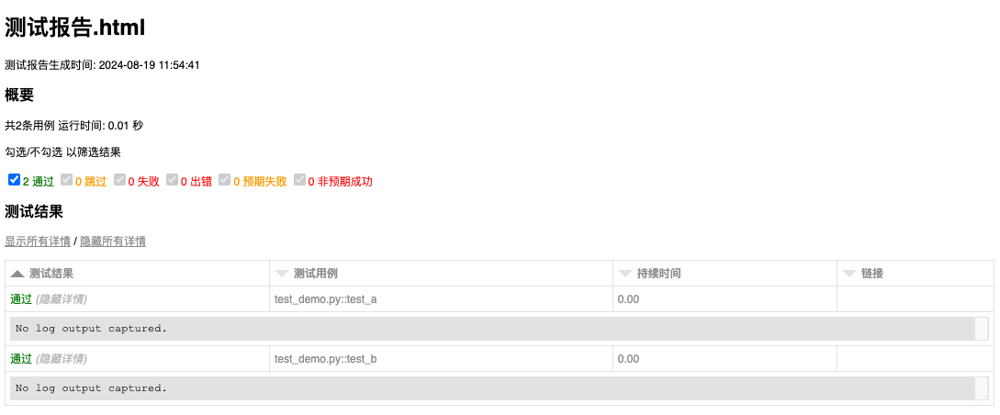

# pytest-html-cn


pytest-html中文版,用于pytest测试执行后，生成HTML测试报告。

## 安装方法
```shell
pip install pytest-html-cn
```
## 使用方式

**test_demo.py**
```python
def test_a():
    pass
    
def test_b():
    pass
```
使用方法
```shell
pytest test_demo.py --html=测试报告.html
```
生成报告如下


